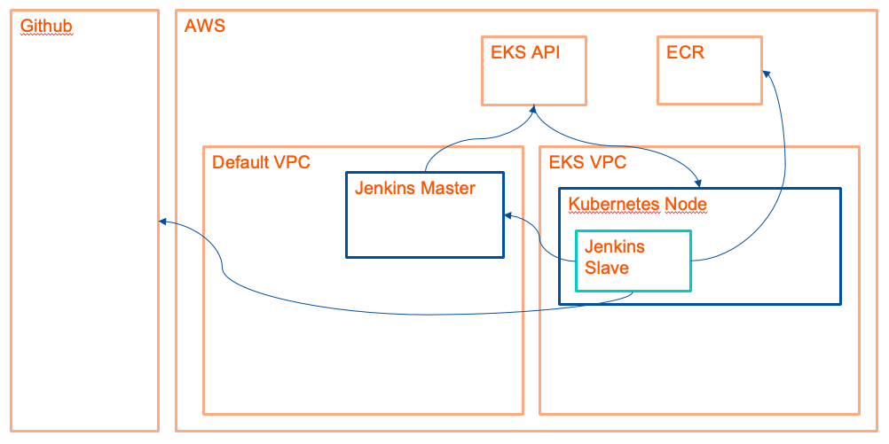

# Docker Security with Kaniko (1 hour)

Interacting with the Docker engine directly through the `docker` command line tool can impose a significant security thread.

In order to improve this risk and limit access to the Docker engine, there are several projects that allow building Docker images without a Docker engine. One of them is **kaniko**, which you will use to build and push a Docker image to ECR.

We will use Jenkins and our previously created EKS cluster in order to build highly secure and scalable build system.

As the setup will be rather complex, before we begin, please have a look at the following graphic that will visualize our final setup:

To do so, please follow these steps:

1. Create an IAM Role for your Jenkins EC2 Instance
    
    1. Go to your AWS Console and open the IAM menu
    1. Go to Roles
    1. Click on "Create role"
    1. Click on "EC2" and confirm with "Next: Permissions"
    1. Click on "Next: Tags"
    1. Click on "Next: Review"
    1. Give it the name "role-jenkins-master"
    1. Go to the EC2 menu
    1. Select your Jenkins EC2 instance and click on "Actions" -> "Instance Settings" -> "Attach/Replace IAM Role" and select the previously created role from the drop-down menu.

1. Install the Jenkins Kubernetes Plugin
1. Update the aws-auth ConfigMap in your EKS cluster
1. Update your Jenkins Security Group
1. Create a new kubeconfig and upload it to the Jenkins Kubernetes Plugin
1. Add permissions to NodeGroup role
1. Create docker-config configmap

After all these steps are done, you can create a pipeline with the example below:

    pipeline {
    agent {
        kubernetes {
        //cloud 'kubernetes'
        yaml """
    kind: Pod
    metadata:
    name: kaniko
    spec:
    containers:
    - name: kaniko
        image: gcr.io/kaniko-project/executor:debug-539ddefcae3fd6b411a95982a830d987f4214251
        imagePullPolicy: Always
        command:
        - cat
        tty: true
        volumeMounts:
        - name: docker-config
            mountPath: /kaniko/.docker
    volumes:
        - name: docker-config
        configMap:
            name: docker-config
    """
        }
    }
    stages {
        stage('Build with Kaniko') {
        steps {
            git 'https://github.com/prabhatsharma/sample-microservice'
            container(name: 'kaniko') {
                sh '''
                /kaniko/executor --dockerfile `pwd`/Dockerfile --context `pwd` --destination=XXXXXXXXXXXX.dkr.ecr.us-east-1.amazonaws.com/sample-microservice:latest --destination=XXXXXXXXXXXX.dkr.ecr.us-east-1.amazonaws.com/sample-microservice:v$BUILD_NUMBER
                '''
            }
        }
        }
    }
    }

Please replace mydockerregistry:5000 with XXXXXXXXXXXX.dkr.ecr.us-east-1.amazonaws.com , where XX... represents your AWS Account ID.
